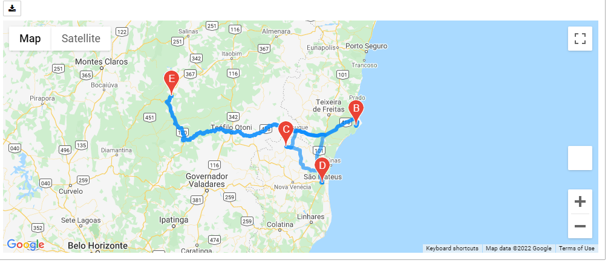
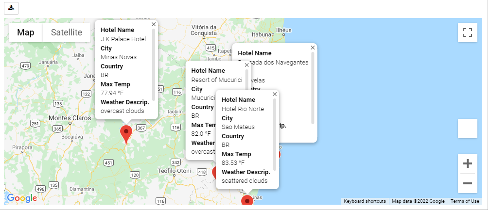
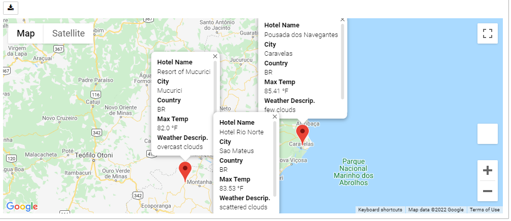

# World_Weather_Analysis
## Deliverable 1
  - [Weather_Database](Weather_Database/Weather_Database.ipynb)
  - [WeatherPy_Database.csv](Weather_Database/WeatherPy_Database.csv)

## Deliverable 2
  - [Vacation_Search.ipynb](Vacation_Search/Vacation_Search.ipynb)
  - [Vacation_Search.ipynb](Vacation_Search/WeatherPy_vacation.csv)
  - WeatherPy_vacation_map.png: 
   

## Deliverable 3
  - [Vacation_Itinerary.ipynb](Vacation_Itinerary/Vacation_Itinerary.ipynb)
  - WeatherPy_travel_map.png:
    
  - WeatherPy_travel_map_markers_start&end_city.png:
    
  - WeatherPy_travel_map_markers_waypoints.png:
    
