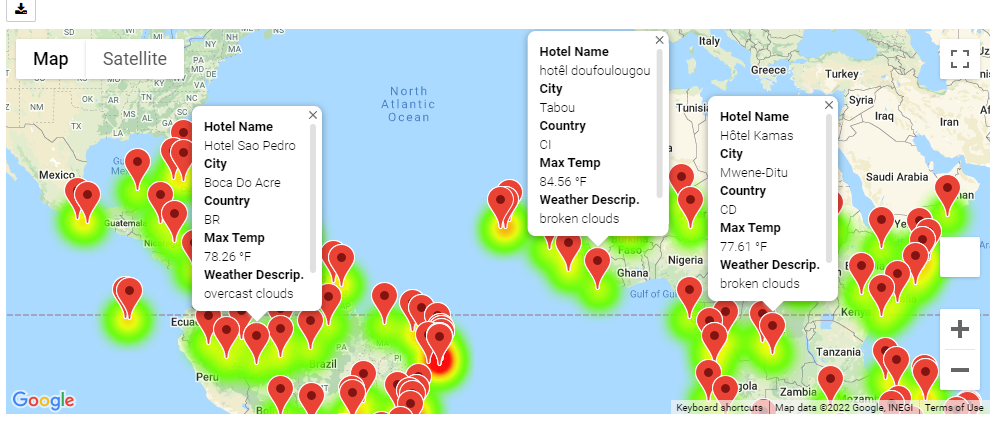

# World_Weather_Analysis
## Deliverable 1
  - [Weather_Database](Weather_Database/Weather_Database.ipynb)
  - [WeatherPy_Database.csv](Weather_Database/WeatherPy_Database.csv)
 
## Deliverable 2
  - [Vacation_Search.ipynb](Vacation_Search/Vacation_Search.ipynb)
  - [Vacation_Search.ipynb](Vacation_Search/WeatherPy_vacation.csv)
  - 

## Deliverable 3
